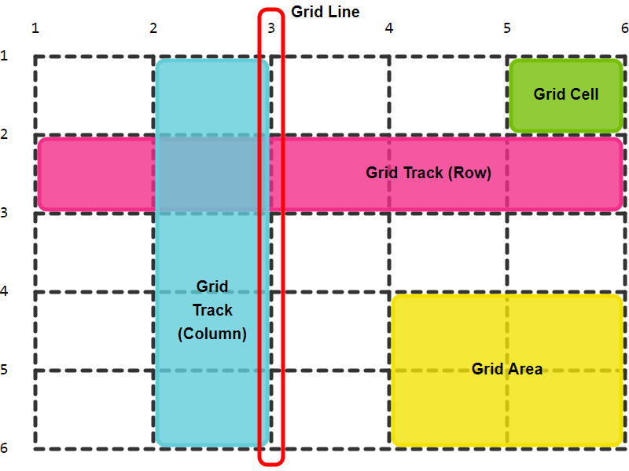

# Grid css

Grid CSS es un sistema de maquetación bidimensional, donde tenemos filas y columnas al mismo tiempo.

Ha sido pensado para planificar las estructuras y secciones que definen las interfaces principales de los sitios y las aplicaciones web, es decir, lo que generalmente bocetamos en una propuesta visual como wireframes o zonas de contenido, ahora esas estructuras las podemos definir en código con Grid CSS.

# Concepetos Básicos

- *Contenedor Padre* **(Grid Container)**.
- *Elementos Hijos* **(Grid Items)**.
- *Líneas de Cuadrícula* **(Grid Lines)**.
- *Pista de Cuadrícula* **(Grid Track)**.
- *Celda de Cuadrícula* **(Grid Cell)**.
- *Área de Cuadrícula* **(Grid Area)**.

